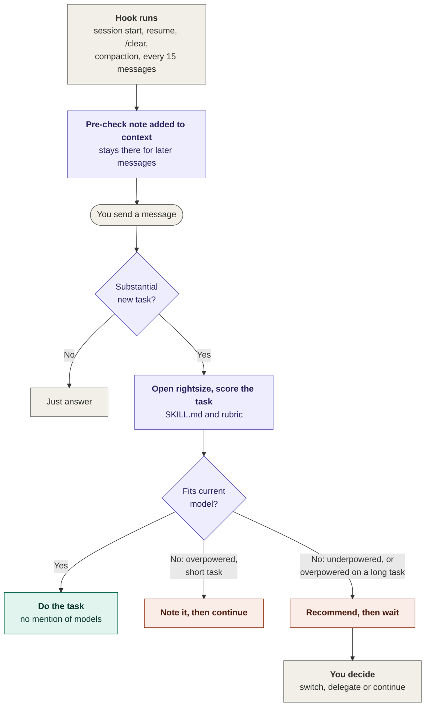

# Rightsize

**Use the cheapest Claude model and effort level that will still do the job well.**

Most people either run everything on the most powerful model (wasting tokens and usage limits) or on the default (and redo work that needed more). Rightsize checks each substantial task against the model you're on and tells you when a cheaper or stronger one would be better. When the model fits, it stays out of the way.

It's Claude-only by design, which keeps the recommendations specific and up to date.

## Install

Rightsize works in Claude Code and Claude.ai. Pick the one you use, or set up both.

### Claude Code (fully automatic)

You'll need [Claude Code](https://code.claude.com) installed. Then, inside Claude Code, run:

```
/plugin marketplace add str58290/rightsize
/plugin install rightsize@rightsize
```

The first command adds this repository as a plugin source; the second installs Rightsize from it. The pre-check is on from your next session, with nothing else to set up.

Two settings in `/config` let you adjust it:

- **Automatic pre-check**: switch off to keep the subagents but only use Rightsize when you ask.
- **Refresh the pre-check every N messages** (default 15): how often the reminder is re-added in long sessions. Leave it empty to use the default. Lower is more reliable, higher is cheaper, and 0 refreshes only at session start and after compaction.

To update to the latest version:

```
/plugin marketplace update rightsize
```

To uninstall:

```
/plugin uninstall rightsize@rightsize
```

### Claude.ai (one-time setup)

1. **Enable code execution.** Skills need it. On Free, Pro and Max plans, go to **Settings > Capabilities** and turn on **Code execution and file creation**. On Team and Enterprise plans, your organization owner controls whether skills are available.
2. **Download the skill.** Get [`rightsize-skill.zip`](https://github.com/str58290/rightsize/releases/latest/download/rightsize-skill.zip) from the [latest release](https://github.com/str58290/rightsize/releases/latest). Don't unzip it.
3. **Upload it.** In Claude.ai, open **Settings** and find **Skills** , choose to upload a skill, and select the ZIP file. Check that Rightsize is toggled on. Uploaded skills are private to your account.
4. **Turn on the automatic pre-check.** In Claude.ai, open **Settings** and find **Instructions for Claude** (on some accounts it's called "personal preferences", under "What personal preferences should Claude consider in responses?"). Searching Settings for "instructions" is the quickest way to find it. Paste this line and save:

   > Before starting any substantial new task, run the rightsize skill's pre-check. If my current model fits, don't mention it.

   You only do this once: these instructions apply to every conversation. Claude.ai has no equivalent of Claude Code's hooks, so this line is what makes the check run without you asking. Skip it if you'd rather only use Rightsize when you ask.

To update, download the latest ZIP, delete the old skill in your settings, and upload the new one.

### From source

To try the latest unreleased version, or to change Rightsize for your own use:

```
git clone https://github.com/str58290/rightsize.git
cd rightsize
claude --plugin-dir ./plugins/rightsize
```

This starts Claude Code with the plugin loaded from your local copy, so your edits take effect without reinstalling. To package the skill for Claude.ai yourself, zip the `plugins/rightsize/skills/rightsize` folder.

## How it works in practice

Rightsize runs as a **pre-check** before substantial tasks. You don't call it.

- **Model fits:** you notice nothing. Claude just does the task.
- **Model is overpowered:** for a short task, Claude adds one line ("this is a Haiku-level task, you could switch") and continues. For a long or heavy task, it asks before starting, because that's where the savings are.
- **Model is underpowered:** Claude pauses and suggests a stronger model before starting, because a weak first attempt usually gets redone.

Quick questions, follow-ups and small edits are never checked, and Claude won't raise the same task twice.

### Workflow



The top two steps happen only at the moments listed; everything from "You send a message" down repeats for every message. In Claude.ai there are no hooks, so the preferences line you paste during setup takes the place of the note.

You can also ask directly ("which model should I use for this?") for a full recommendation, or for a setting per step in a multi-step workflow:

```
Recommendation: Sonnet 5.5 at medium effort
Why: Long input, but the task is summarising, not deep reasoning.
Step down if: The brief is for your own use only.
Step up if: The summary must weigh conflicting sections or go to a client.
How to set it: Choose Sonnet in the model picker.
```

## What's included

| Component | Works in | What it does |
|---|---|---|
| `rightsize` skill | Claude.ai, Claude Code | The pre-check, plus full recommendations on request |
| Session hooks | Claude Code | Turn the pre-check on automatically: at session start, after `/clear` and compaction, and again every 15 messages so it never fades in long sessions |
| Tiered subagents | Claude Code | `light-worker` (Haiku, low), `standard-worker` (Sonnet, medium), `deep-worker` (Opus, high), so Claude Code can delegate each sub-task at the right cost |
| Rubric | Everywhere | The shared scoring logic in `plugins/rightsize/skills/rightsize/references/rubric.md` |
| Benchmark | Contributors | Test tasks and a method for checking the rubric against real results |

## How the scoring works

Each task is scored from 0 to 2 on reasoning depth, context load, stakes, ambiguity, and horizon (how long it runs). The total maps to a starting model and effort, and a few overrides take priority. For example, anything high-stakes gets at least Sonnet at high effort, and when in doubt the rubric rounds up, because a redo costs more than the difference. See the full [rubric](plugins/rightsize/skills/rightsize/references/rubric.md).

## Limitations

- The pre-check runs on a model that's already been chosen, so it can only advise; you (or Claude Code's subagents) make the switch. The check itself costs a little reasoning on the current model.
- Claude needs to know which model it's running on. If it can't tell, it skips the check rather than guess.
- Triggering depends on Claude following the standing instruction. It's reliable for clearly substantial tasks, less so for borderline ones. In Claude Code the reminder is refreshed every 15 messages and after compaction; Claude.ai has no hooks, so there it relies on your preferences, which are included in every conversation.
- v0.1 is seeded from Anthropic's documentation and has not yet been validated by the benchmark. Treat it as a well-informed starting point.
- Models change often. Check the "last verified" date in [models.md](plugins/rightsize/skills/rightsize/references/models.md).

## Roadmap

- **v0.1**: rubric, automatic pre-check, Claude Code plugin with tiered subagents
- **v0.2**: first published benchmark results; rubric adjusted from data
- **v0.3**: n8n / API workflow template for fully automatic routing

## Contributing

See [CONTRIBUTING.md](CONTRIBUTING.md). The most valuable contribution is benchmark results from real tasks.

## Disclaimer

Community project, not affiliated with or endorsed by Anthropic.

## License

MIT
